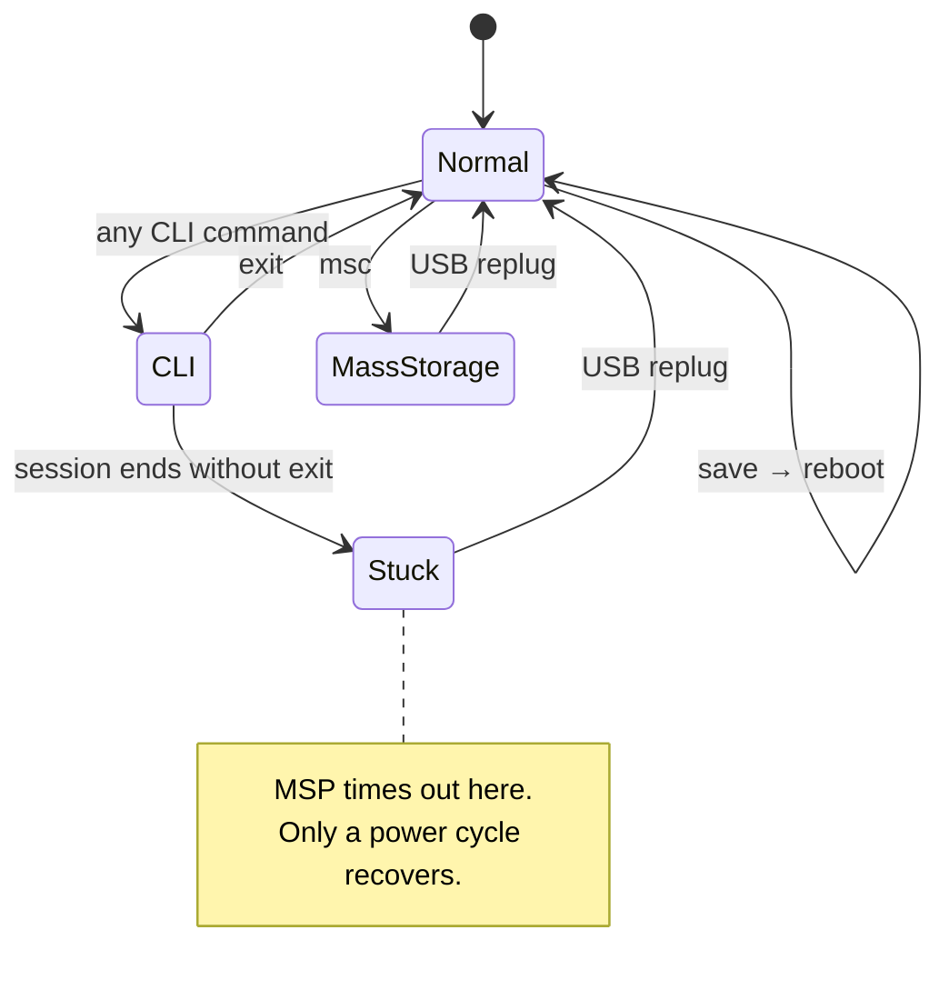

Three different problems all show up as "the board stopped responding". They can be told
apart by the exact error, and they have nothing to do with each other. Byte has met all
three, usually on the same evening.

## Mode transitions

Understanding which mode the board is in explains all three:



## The three failure modes




**Symptom.** MSP requests time out, and any attempt to run a CLI command fails with:

```text
Error: CLI prompt not received within 5000ms. Buffer: "#"
```

Running `status` may also show `CLI` among the arming disable flags:

```text
Arming disable flags: RXLOSS CLI DSHOT_TELEM
```

**Cause.** The board entered CLI mode and never left. Betaflight only exits CLI on an
explicit `exit` or a reboot. While in CLI it does not speak MSP at all, so binary reads
time out. Worse, a tool trying to *enter* CLI sends `#` and waits for a fresh prompt — which
never comes, because the board is already at one. The stale `#` in the buffer is the
signature.

**Fix.** Unplug and replug the USB cable. Closing and reopening the serial port on the host
does **not** help — the state lives in the firmware, not the connection.

**Prevention.** End every CLI interaction with `exit` (or `save`, which reboots).



**Symptom.**

```text
Failed to connect: Error: No such file or directory, cannot open /dev/ttyACM1
```

**Cause.** The board re-enumerates on every replug and does not reliably get the same
device node. It alternates between `/dev/ttyACM0` and `/dev/ttyACM1` depending on what else
has claimed a node in the meantime.

**Fix.** Re-list the ports rather than reusing the previous path:

```bash
ls /dev/ttyACM*
```

The Betaflight device identifies itself, so a tool that enumerates properly will show it as
such along with its serial number.



**Symptom.** The port opens without error, nothing holds it, the board is enumerated and
healthy — and **zero bytes** come back. No prompt, no echo, no error.

**Cause.** The CLI is entered with a **bare `#` and no line ending**. Sending `#\r\n` or
`#\n` is parsed as an empty command and never opens the CLI, so the board simply stays silent.

This is the most misleading failure of the four, because it is indistinguishable from a dead
board: the port is fine, `fuser` is clear, the USB ID is right, and nothing is stuck. Probing
it directly makes the difference obvious:

```text
bare #      ->  59 bytes  "\r\nEntering CLI Mode, type 'exit' to reboot, or 'help'\r\n\r\n# "
# + LF      ->   7 bytes  "#\r\n\r\n# "
newline     ->   0 bytes
```

**Fix.** Write `b"#"` with no terminator. Everything *after* that is line-based and needs
`\r\n` as normal.

```python
ser.write(b"#")          # enter CLI — no line ending
ser.write(b"status\r\n") # subsequent commands are normal lines
```

**Then always leave.** `exit` reboots the board; `exit noreboot` drops out of CLI and keeps
MSP available without a restart — useful when the next thing you want is a binary request.

A driver handling all of this lives at `betamcp/tools/bf_cli.py`:

```bash
python3 tools/bf_cli.py "status" "get osd_profile"
python3 tools/bf_cli.py --save "set osd_vbat_pos = 6529"
```

It finds the board by **USB serial number** rather than device path, so it ignores the EdgeTX
radio (which shares vendor and product IDs) and survives the `ttyACM0`/`ttyACM1`/`ttyACM2`
shuffle after every reboot. It always exits the CLI on the way out.



**Symptom.**

```text
Failed to connect: Error: Device or resource busy, cannot open /dev/ttyACM1
```

**Cause.** Another process already holds the port open. The usual culprit is a browser tab
running the web Configurator, which keeps its Web Serial connection open until the tab is
closed.

**Fix.** Identify the holder and close it:

```bash
fuser /dev/ttyACM1
# or, with more detail:
lsof /dev/ttyACM1
```

```text
COMMAND     PID USER  FD   TYPE DEVICE SIZE/OFF NODE NAME
chrome  2845269 hans 232u   CHR  166,1      0t0 3953 /dev/ttyACM1
```

Close that tab or process and reconnect. `fuser` returning nothing means the port is free.




## Telling them apart quickly

| Error text | Mode | Fix |
| --- | --- | --- |
| `CLI prompt not received … Buffer: "#"` | Stuck in CLI | Replug USB |
| `No such file or directory` | Path moved | Re-enumerate `/dev/ttyACM*` |
| `Device or resource busy` | Port held | `fuser`, close the holder |
| **Zero bytes, no error at all** | Wrong CLI entry | Send a bare `#`, no line ending |
| USB ID is `0483:df11` | Board is in DFU | Replug without holding boot |
| MSP times out but CLI works fine | Not a fault | See [MSP over USB](/docs/betaflight-mcp-claude-code/) |


Check the USB ID before diagnosing anything else — it settles several of these at once.
`0483:5740` is the normal virtual COM port, `0483:5720` is mass storage, and `0483:df11` is
the DFU bootloader. Note that **EdgeTX radios use the same STM32 IDs**, so a handset plugged
in alongside the quad is easy to mistake for the flight controller. Match on the serial
number, not the vendor ID.


That last row matters: on this build most MSP reads time out permanently by firmware
version, not by connection state, and no amount of replugging changes it.
